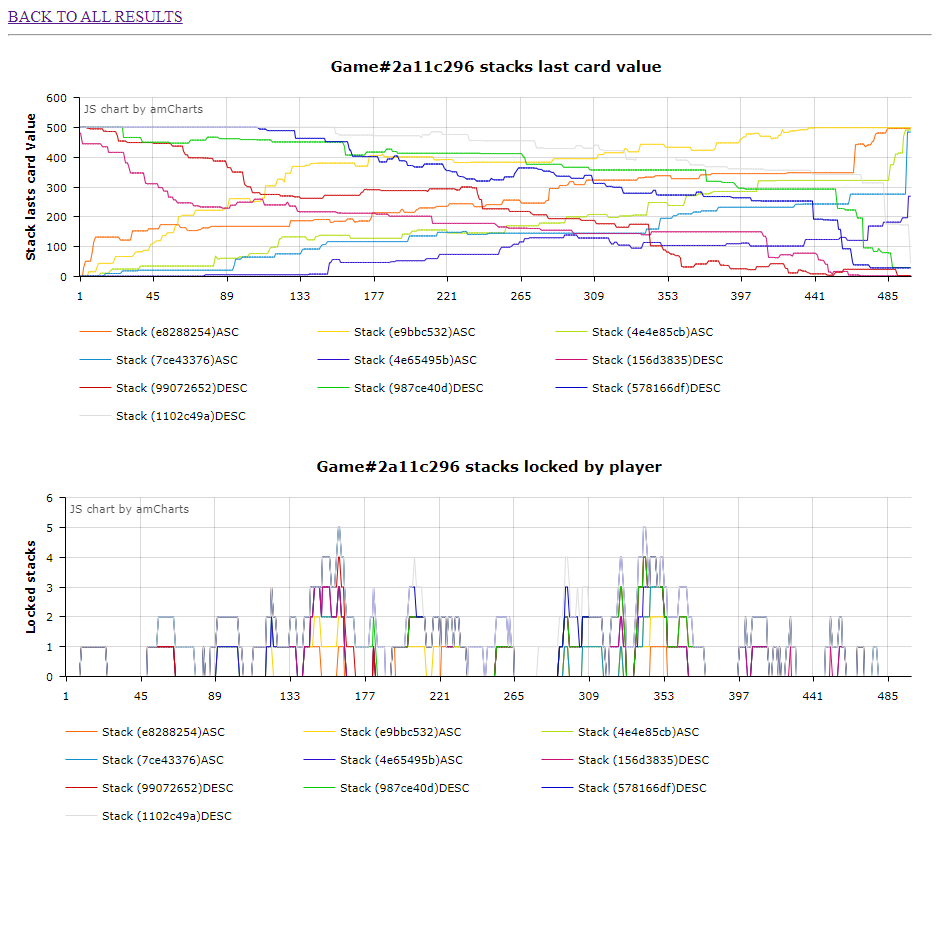

# "The Game" : Short Simulation

This script is a simulation and vizualtion tool of the game ["The Game"](https://www.jeuxdenim.be/jeu-TheGame).

This is a test to found what is the best strategy to adopt in this cool game.

## Installation

Clone this repository.

Optionnaly, make virtualenv :
```bash
python3 -m virtualenv ./venv
source ./venv/bin/activate
```

> This require Python 3.

```bash
pip install -r ./requirements.txt
```

## Usage

__Run a single simulation with debug__

```
python cli.py simulate --help

	Usage: cli.py simulate [OPTIONS]

	  Launch a single simulation with an only type of IA.

	Options:
	  -R, --range TEXT       The range of cards, from min to max, separated by a
	                         comma.
	  -p, --players INTEGER  Number of players.
	  -s, --stacks INTEGER   Number of stacks by order.
	  -h, --hand INTEGER     Size of players hand.
	  -i, --ia [idiot]       IA type of players.
	  --help                 Show this message and exit.

```

__Simulation results overview__

```
python cli.py serve --help

	Usage: cli.py serve [OPTIONS]

	  Launch a simulationm wait for a given number of results and run a web server to show it.
	  results.

	Options:
	  -R, --range TEXT       The range of cards, from min to max, separated by a
	                         comma.
	  -p, --players INTEGER  Number of players.
	  -s, --stacks INTEGER   Number of stacks by order.
	  -h, --hand INTEGER     Size of players hand.
	  -i, --ia [idiot]       IA type of players.
	  -r, --results INTEGER  Good results goal.
	  -a, --allissues        Keep loosed games (all issues).
	  --help                 Show this message and exit.
```

## Examples

__Run 100 iterations of winned games with 2 players :__

```
python cli.py serve -r 100 -p 2
```

Wait for results ... it can take a little time to execute.

You can see flask is running when calculation is terminated :
```
 * Serving Flask app 'server' (lazy loading)
 * Environment: production
   WARNING: This is a development server. Do not use it in a production deployment.
   Use a production WSGI server instead.
 * Debug mode: on
 * Running on all addresses.
   WARNING: This is a development server. Do not use it in a production deployment.
 * Running on http://0.0.0.0:8080/ (Press CTRL+C to quit)
 * Restarting with stat
 * Debugger is active!
 * Debugger PIN: XXX-XXX-XXX
```

Now let's check results on : `http://localhost:8080/`

__Let's change the game rules :__

To run a simulation with 10 players, and cards from 1 to 500 with 5 (!!!) stacks of each orders (ascending and descending) and 10 cards in each player hand :

```
python cli.py serve -p 10 -R 1,500 -s 5 -h 10
```

Screen of this game result :



